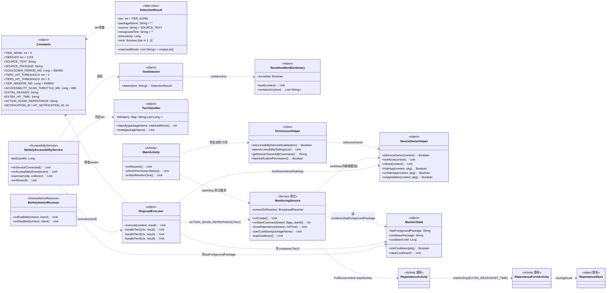
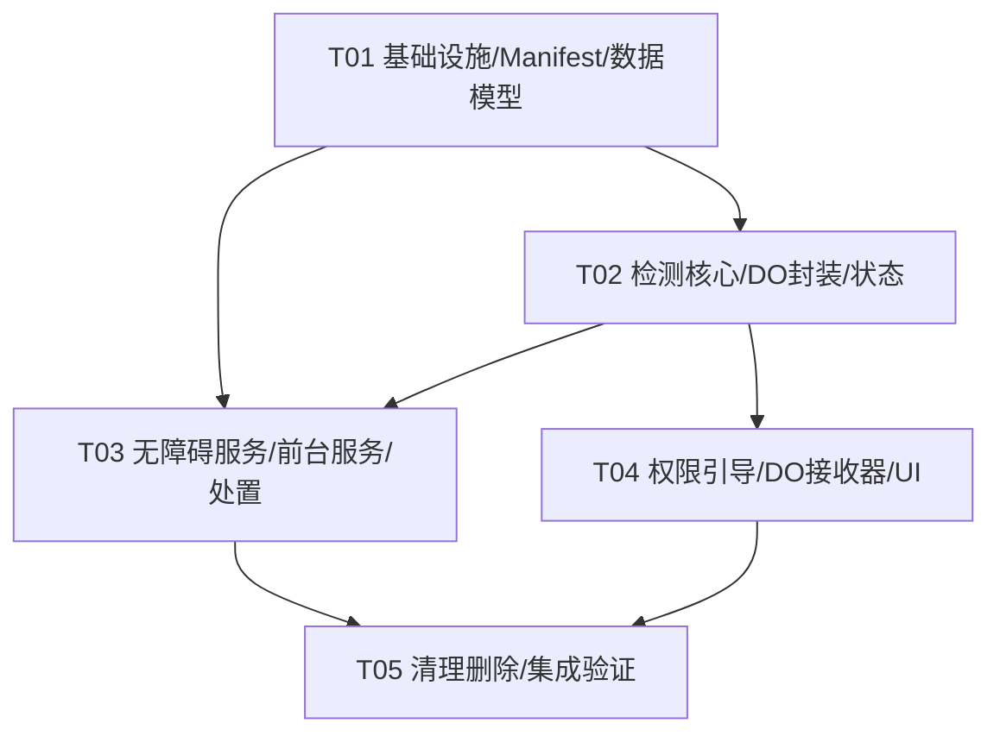

# 增量架构设计：BeHoly 无障碍重构（AccessibilityService 检测 + 分级处置 + Device Owner）

> **作者**：架构师 高见远（software-architect）
> **对应 PRD**：`docs/incremental_prd_accessibility.md`
> **衔接设计**：`docs/incremental_design_repentance.md`（悔改反思日志，本增量复用其全链路，不改动）
> **范围**：仅架构设计 + 任务分解，**不含实现代码**；本增量把检测机制由 MediaProjection 截屏链切换为 AccessibilityService，并新增分级处置、Device Owner 封装、权限引导，移除图像模型与对应依赖
> **平台与约束**：
> - Android 离线个人 App（Kotlin + AndroidX）；包名 `com.example.beholy`；**minSdk = 29**
> - **compileSdk / targetSdk = 34（保持，详见 §风险与待明确事项 R1；功能所需 API 在 34 均已可用）**
> - AGP 8.2.2 / Gradle 8.3 / JDK 17（保持不变，避免联动升级）
> - 目标设备：魅族 21 / 骁龙 8 Gen 2 / Android 16（API 36）
> - **强制离线铁律**：Manifest 不声明 `INTERNET`，无任何网络调用（DevicePolicyManager / AccessibilityService 均为本地 API，符合铁律）
> - 代码不写死未来无法升级的假设（如 `Build.VERSION.SDK_INT` 判断仅在确实需要处使用）

---

## 1. 实现方案与选型说明

### 1.1 核心难点与方案选择

| 难点 | 现有方案（基线）痛点 | 本增量方案 | 选型理由 |
|------|----------------------|------------|----------|
| 检测机制 | MediaProjection 截屏 → ML Kit OCR + TFLite 图像评分；锁屏易被系统/OEM 回收、需反复授权、轮询耗电 | **AccessibilityService** 事件驱动遍历 `AccessibilityNodeInfo` 视图树取 `text`+`contentDescription`+`packageName`，匹配 `SensitiveWordDictionary` | 常驻、跨锁屏无感、零轮询、无需授权反复弹窗；无障碍拿不到屏幕像素，图像模型物理不可行，顺势移除 ML Kit/TFLite |
| 处置强度 | 仅弹悔改页 | **分级处置**（Tier1 踢回桌面+悔改 / Tier2 封禁+锁屏+冷静期 / Tier3 封禁+锁屏+重启） | 干预强度随风险递增；Tier2/3 依赖 `DevicePolicyManager`（需 Device Owner） |
| 后台拉起 Activity（Android 10+ 限制） | 旧方案用前台服务 + FullScreenIntent 通知 | **前台常驻服务 `MonitoringService`** 承接常驻通知 + 合规拉起悔改页（FullScreenIntent + 直接 `startActivity`，双重保障） | Android 10 起禁止后台 Service 直接 `startActivity`；经前台服务高优通知 FullScreenIntent 是官方合规路径；叠加 `SYSTEM_ALERT_WINDOW` 豁免提升魅族等 OEM 可靠性（见 §1.4） |
| 管控能力（封禁/锁屏/重启） | 无 | **Device Owner**（`adb dpm set-device-owner` 一次性）+ `DeviceOwnerHelper` 封装 | `setApplicationHidden`/`lockNow`/`reboot` 仅 Device Owner/Profile Owner 可用；非 DO 场景优雅降级为 Tier1 |
| 词库匹配 | OCR 文本 → `SensitiveWordDictionary.containsAny` | **复用**同一 `SensitiveWordDictionary`，输入由 Bitmap OCR 文本改为节点树聚合文本 | 零新增依赖，匹配逻辑完全一致 |

### 1.2 架构模式

- **事件驱动 + 分层**：`BeHolyAccessibilityService`（检测/分级）↔ `MonitoringService`（常驻通知/合规拉起/冷静期定时器）↔ `DeviceOwnerHelper`（DO 能力）↔ 既有悔改流程（`RepentanceActivity`→`RepentanceFormActivity`→`RepentanceStore`）。
- 检测与处置解耦：服务只负责「检测→产出 `DetectionResult`→判定 `tier`」，具体处置交给 `DisposalExecutor`（含 DO 降级判断），便于单测与后续策略调整。
- 进程内共享状态 `MonitorState`（object）桥接 AccessibilityService 与 MonitoringService，避免跨服务绑定复杂度。

### 1.3 检测节流与性能（回应 PRD Q9）

- `AccessibilityService` 配置 `eventTypes = TYPE_WINDOW_STATE_CHANGED | TYPE_WINDOW_CONTENT_CHANGED`，`canRetrieveWindowContent = true`。
- 全局扫描节流 `ACCESSIBILITY_SCAN_THROTTLE_MS = 800ms`（连续窗口内容变更事件合并，避免长列表动态内容刷屏误命中/耗电）。
- 节点遍历从 `event.source`（优先）或 `rootInActiveWindow` 递归收集 `text`+`contentDescription`，遍历后 `recycle()` 释放节点。
- 自身包名 `com.example.beholy` 直接跳过，避免自我触发。
- `FLAG_SECURE` 的窗口不暴露节点树（已知限制，见 §风险 R4）。

### 1.4 后台启动 Activity 的合规方案（Android 10 → 16）

**问题**：Android 10（API 29）起，后台 Service/应用无法随意 `startActivity`；AccessibilityService 虽权限较高，但在 Android 12+ 与部分国产 ROM（魅族）上直接拉起仍可能被限制。

**合规方案（双重兜底）**：
1. **主路径（合规）**：`BeHolyAccessibilityService` 命中 Tier1 → `performGlobalAction(GLOBAL_ACTION_HOME)` 踢回桌面 → 通过 `ContextCompat.startForegroundService` 向 `MonitoringService` 发送 `ACTION_SHOW_REPENTANCE` 指令。`MonitoringService` 作为**前台服务**弹出 `IMPORTANCE_HIGH`/`PRIORITY_MAX` 通知，其 `PendingIntent` 使用 `setFullScreenIntent`，系统允许在前台服务上下文下拉起 `RepentanceActivity`（即使锁屏/后台）。
2. **兜底（权限豁免）**：本应用已声明并引导授予 `SYSTEM_ALERT_WINDOW`（"显示在其他应用上层"）。在该权限下，应用可自后台启动 Activity（Android 后台启动限制的已知豁免项）。因此 `MonitoringService` 在发通知的同时也直接 `startActivity(repentanceIntent, NEW_TASK|CLEAR_TOP)`。`RepentanceActivity` 自身 `showWhenLocked`+`turnScreenOn` 保证锁屏可见。

**Android 16 行为说明**：
- 后台启动限制与 FullScreenIntent 机制在 Android 16 仍有效；FullScreenIntent 在用户关闭"全屏通知"权限时可能被系统降级为普通通知（此时兜底的直接 `startActivity`+`SYSTEM_ALERT_WINDOW` 仍生效）。
- `reboot()`（Tier3）执行后设备重启；AccessibilityService 是否需用户重新开启取决于魅族系统自启策略（PRD Q7，需真机验证）；Device Owner 与 `setApplicationHidden` 封禁状态**持久**（跨重启保持）。

---

## 2. 文件清单（新增 / 修改 / 删除）

> 路径均相对工程根 `BeHoly/`。`RepentanceActivity.kt` / `RepentanceFormActivity.kt` / `RepentanceStore.kt` / `RepentanceRecord.kt` / `HitLogger.kt` / `InAppLogger.kt` / `DailyVerse.kt` / `BeHolyApp.kt` **本增量不改动**（悔改链路沿用）。

### 2.1 新增文件

| 相对路径 | 职责 |
|----------|------|
| `app/src/main/java/com/example/beholy/service/BeHolyAccessibilityService.kt` | 无障碍检测服务：事件驱动遍历节点树→聚合文本+包名→匹配词库→判定 tier→调用 `DisposalExecutor` |
| `app/src/main/java/com/example/beholy/service/MonitoringService.kt` | 轻量前台服务（由 `ScreenMonitorService` 重写而来）：常驻通知 + 合规拉起悔改页 + 冷静期定时器/屏幕解锁监听 |
| `app/src/main/java/com/example/beholy/util/DeviceOwnerHelper.kt` | Device Owner 能力封装（object）：`isDeviceOwner`/`lockNow`/`reboot`/`hideApp`/`unhideApp`/`isAppHidden` + 非 DO 降级 |
| `app/src/main/java/com/example/beholy/util/MonitorState.kt` | 进程内共享状态（object）：`lastForegroundPackage` + 冷静期 `cooldownPackage`/`cooldownUntil` |
| `app/src/main/java/com/example/beholy/util/DisposalExecutor.kt` | 分级处置执行器（object）：按 `tier` 执行 HOME/封禁+锁屏/封禁+锁屏+重启，含非 DO 降级与冷却期启动 |
| `app/src/main/java/com/example/beholy/detection/text/TextDetector.kt` | 文本命中检测器（替换 `TextNsfwDetector` 的 OCR 角色）：`detect(text:String): DetectionResult`，复用 `SensitiveWordDictionary` |
| `app/src/main/java/com/example/beholy/detection/TierClassifier.kt` | 分级判定（object）：`classify(packageName, matchedWords): Int`，基于累计同包命中阈值 + 预留高危词集 |
| `app/src/main/java/com/example/beholy/ui/BeHolyAdminReceiver.kt` | `DeviceAdminReceiver` 子类（空实现 + 启用/停用日志），Manifest 注册 |
| `app/src/main/res/xml/beholy_accessibility_service.xml` | 无障碍服务配置（eventTypes/flags/canRetrieveWindowContent 等） |
| `app/src/main/res/xml/device_admin_policies.xml` | Device Admin 策略声明（最小权限，仅用于 DO 能力） |

### 2.2 修改文件

| 相对路径 | 修改点 |
|----------|--------|
| `app/build.gradle.kts` | 移除 ML Kit `text-recognition-chinese`、TensorFlow Lite（`tensorflow-lite`/`tensorflow-lite-support`）依赖；移除 `aaptOptions.noCompress("tflite")`（无 .tflite 资产后无意义）；`compileSdk`/`targetSdk` 保持 34 |
| `app/src/main/AndroidManifest.xml` | 移除 `FOREGROUND_SERVICE_MEDIA_PROJECTION` 权限与 `mediaProjection` 前台服务类型；新增无障碍服务声明（`BIND_ACCESSIBILITY_SERVICE` 权限 + meta-data 指向 xml）+ `BeHolyAdminReceiver`（`BIND_DEVICE_ADMIN` + meta-data）+ 保留 `FOREGROUND_SERVICE`/`POST_NOTIFICATIONS`/`SYSTEM_ALERT_WINDOW`/`PACKAGE_USAGE_STATS` |
| `app/src/main/java/com/example/beholy/data/Constants.kt` | 移除图像/模型常量；新增 tier 常量（`TIER_NONE/1/2/3`、`SOURCE_TEXT/SOURCE_PACKAGE`）、冷静期与阈值常量、扫描节流、服务指令 action 常量 |
| `app/src/main/java/com/example/beholy/data/DetectionResult.kt` | 去 `isImageNsfw`/`imageScore`；新增 `tier`/`packageName`/`matchedWords`/`source`；`isHit` 由 `tier in 1..3` 决定 |
| `app/src/main/java/com/example/beholy/ui/MainActivity.kt` | 移除 MediaProjection 授权流程；新增无障碍开关状态自检 + Device Owner 状态自检；新增两步引导区（开启无障碍 / 配置 DO 含 adb 命令）；保留"查看记录/停止/日志" |
| `app/src/main/java/com/example/beholy/ui/PermissionHelper.kt` | 移除 `requestScreenCapture`/`MediaProjection`；新增 `isAccessibilityServiceEnabled`/`openAccessibilitySettings`/`getDeviceOwnerAdbCommand`；保留 `hasNotificationPermission` |
| `app/src/main/res/values/strings.xml` | 新增无障碍引导、Device Owner 引导、状态指示、adb 命令、卸载约束提示、分级处置相关文案 |
| `app/src/main/res/layout/activity_main.xml` | 新增「步骤1 无障碍权限」「步骤2 Device Owner 配置」两个引导区块 + 状态指示灯 + 卸载约束提示条 |

### 2.3 删除文件

| 相对路径 | 删除原因 |
|----------|----------|
| `app/src/main/java/com/example/beholy/capture/ScreenCapturer.kt` | MediaProjection 截屏，物理不可行（无障碍拿不到像素） |
| `app/src/main/java/com/example/beholy/capture/CaptureConfig.kt` | 截屏配置，随截屏链移除 |
| `app/src/main/java/com/example/beholy/service/DetectionLoop.kt` | MediaProjection 轮询检测循环，由无障碍事件驱动取代 |
| `app/src/main/java/com/example/beholy/detection/image/ImageNsfwDetector.kt` | TFLite 图像 NSFW 检测，移除 |
| `app/src/main/java/com/example/beholy/detection/image/TfLiteModelLoader.kt` | TFLite 模型加载，移除 |
| `app/src/main/java/com/example/beholy/detection/text/TextNsfwDetector.kt` | ML Kit OCR 位图检测，由 `TextDetector`（节点文本）取代 |
| `app/src/main/java/com/example/beholy/detection/Detector.kt` | `detect(Bitmap)` 接口，实现者均已移除，新检测签名不同 |
| `app/src/main/java/com/example/beholy/util/BitmapUtils.kt` | Bitmap 复用池，仅截屏链使用 |
| `app/src/main/java/com/example/beholy/util/CpuAffinity.kt` | 小核绑定，仅 `DetectionLoop` 使用 |
| `app/src/main/java/com/example/beholy/service/ScreenMonitorService.kt` | 重写为 `MonitoringService.kt`（删除/重命名） |
| `app/src/main/assets/open_nsfw_quant.tflite` | 23MB 图像模型资产，移除（构建目录 `build/intermediates/...` 中的副本随重新构建自动消失） |

---

## 3. 数据结构与接口（Mermaid `classDiagram`）



---

## 4. 程序调用流程（Mermaid `sequenceDiagram`，覆盖 检测→分级→处置→悔改 全链路）

```mermaid
sequenceDiagram
    participant A11y as BeHolyAccessibilityService
    participant Txt as TextDetector
    participant Tier as TierClassifier
    participant Disp as DisposalExecutor
    participant DO as DeviceOwnerHelper
    participant FG as MonitoringService
    participant RX as 屏幕解锁监听(BroadcastReceiver)
    participant Rep as RepentanceActivity
    participant Form as RepentanceFormActivity
    participant Store as RepentanceStore

    Note over A11y: 系统 Accessibility 事件（窗口切换/内容变更）
    A11y->>A11y: onAccessibilityEvent(event)
    A11y->>A11y: 取 packageName；跳过本应用包名
    A11y->>A11y: 节流判断(ACCESSIBILITY_SCAN_THROTTLE_MS)
    A11y->>A11y: 遍历 rootInActiveWindow 收集 text+contentDescription
    A11y->>A11y: MonitorState.lastForegroundPackage = pkg
    A11y->>Txt: detect(聚合文本)
    Txt->>Txt: SensitiveWordDictionary.containsAny(text)
    Txt-->>A11y: DetectionResult(matchedWords)
    A11y->>Tier: classify(pkg, matchedWords)
    Tier-->>A11y: tier (1/2/3)
    A11y->>A11y: 构造 DetectionResult(tier,pkg,matchedWords,source,timestamp)
    A11y->>Disp: execute(context, result)

    alt Tier1 普通命中
        Disp->>A11y: performGlobalAction(GLOBAL_ACTION_HOME) 踢回桌面
        Disp->>FG: startForegroundService(ACTION_SHOW_REPENTANCE, reason, hitTime)
        FG->>FG: 高优通知 FullScreenIntent + startActivity(Rep)
        Rep-->>FG: 悔改页显示（锁屏可见）
        Note over Rep,Form: 用户点击「我愿意悔改归向神」
        Rep->>Form: startActivity(EXTRA_REASON, EXTRA_HIT_TIME); finish()
        Form->>Store: save(record)
        Form->>Form: finish() 交托回原App
    else Tier2 明确违规（且 isDeviceOwner）
        Disp->>DO: hideApp(pkg) 封禁
        Disp->>DO: lockNow() 立即锁屏
        Disp->>MonitorState: cooldownPackage=pkg; cooldownUntil=now+COOLDOWN_PERIOD_MS
        Disp->>FG: startCooldown(pkg)
        FG->>RX: 注册 ACTION_USER_PRESENT / SCREEN_ON
        loop 冷静期内用户解锁且前台又落到被封App
            RX->>FG: onReceive(USER_PRESENT)
            FG->>FG: 读 MonitorState.isInCooldown(lastForegroundPackage)
            FG->>DO: lockNow() 循环重锁
        end
        Note over FG: 冷静期到期 → stopCooldown 注销接收器（封禁保持）
    else Tier3 严重/多次（且 isDeviceOwner）
        Disp->>DO: hideApp(pkg) 封禁
        Disp->>DO: lockNow() 立即锁屏
        Disp->>DO: reboot() 重启设备（关机替代）
    else 非 Device Owner 且 tier≥2（优雅降级）
        Note over Disp: 退化为 Tier1：HOME + 悔改页提示<br/>（MainActivity 引导用户配置 DO）
        Disp->>A11y: performGlobalAction(HOME)
        Disp->>FG: ACTION_SHOW_REPENTANCE（提示需配置 DO）
    end
```

---

## 5. 待明确事项（架构层面，需主理人/用户拍板）

> 以下多为 PRD 已列的 Q1–Q9，作为架构约束记录；本设计已给出「默认可运行」的占位实现，待拍板后仅需调参/改策略，不伤架构。

1. **Tier 判定阈值与升级规则（Q1/Q2）**：本设计默认采用「累计同包命中阈值」——`TIER2_HIT_THRESHOLD=3`、`TIER3_HIT_THRESHOLD=5`（同包 10 分钟内，`TIER_WINDOW_MS`）；并预留 `SEVERE_KEYWORDS` 高危词集（命中即 Tier3，当前为空）。阈值集中在 `Constants` + `TierClassifier`，便于 P1-1 暴露为可配置项。**需确认**：是否改用「特定高危词库分级」「包名黑名单」或「由 Tier2 升级而来」？默认策略是否合适？
2. **Tier1/Tier2 划分标准（Q2）**：同上，默认全部先走 Tier1，累计命中升级。若产品希望「某些词/包直接 Tier2」，填 `SEVERE_KEYWORDS`/包名黑名单即可。
3. **冷静期是否可配置（Q3）**：默认 `COOLDOWN_PERIOD_MS = 300_000`（5 分钟），集中在 `Constants`，P1-2 可暴露配置。
4. **reboot 前倒计时（Q4）**：本设计 Tier3 直接 `reboot()`（P0-4 验收要求）。P2-2 的 3 秒倒计时提示作为后续迭代，不阻塞 P0。
5. **Tier2 封禁是否自动解封（Q5）**：默认**保持封禁**（冷静期结束仅停止重锁循环，不自动 `unhideApp`）。手动解封放 P2-1（`DeviceOwnerHelper.unhideApp` 已封装）。
6. **重启后 AccessibilityService 是否需重开（Q7）**：Device Owner 与封禁状态持久；无障碍服务自启依赖魅族系统策略，需真机（魅族 21 / Android 16）验证。建议真机验证后补充「引导用户授予自启权限」提示。
7. **Device Owner 副作用（Q8）**：一次性 `adb dpm set-device-owner` 后，正常卸载前需先移除设备所有者（通常需出厂重置）。`MainActivity`/文案需中性提示此约束（P1-3）。更轻量的「设备管理员（非 DO）」无法满足 `setApplicationHidden`/`reboot`，故采用 DO。
8. **遍历性能与误触（Q9）**：已用事件类型 + 800ms 节流 + 自身包名跳过缓解；长列表动态内容仍需真机观察误命中率。

---

## 6. 依赖包清单（Required Packages）

> 本增量**移除** ML Kit 与 TensorFlow Lite，不新增任何第三方依赖。保持离线铁律。

```
# —— 移除（P0-6）——
# com.google.mlkit:text-recognition-chinese:16.0.0        # OCR 位图文字识别（改用无障碍节点文本）
# org.tensorflow:tensorflow-lite:2.14.0                   # 图像 NSFW 推理
# org.tensorflow:tensorflow-lite-support:0.4.4            # TFLite support

# —— 保留（不改动版本）——
org.jetbrains.kotlinx:kotlinx-coroutines-android:1.7.3   # 协程（MonitoringService 定时器/IO）
androidx.core:core-ktx:1.12.0
androidx.appcompat:appcompat:1.6.1
androidx.lifecycle:lifecycle-runtime-ktx:2.6.2
androidx.lifecycle:lifecycle-service:2.6.2
androidx.activity:activity-ktx:1.8.0

# —— 系统 API（无需依赖，compileSdk 34 已含）——
# android.accessibilityservice.AccessibilityService
# android.app.admin.DevicePolicyManager / DeviceAdminReceiver
# android.app.admin.DevicePolicyManager.reboot() (API 24+)
# android.app.admin.DevicePolicyManager.setApplicationHidden() (API 21+)
```

无新增 Gradle 依赖；`build.gradle.kts` 仅做**减法**（删 ML Kit/TFLite + `aaptOptions.noCompress("tflite")`）。

---

## 7. 任务列表（有序 + 依赖，≤5 任务，每个 ≥3 文件）

> 任务粒度按「模块/层次」分组；P0 覆盖：AccessibilityService 检测、DeviceOwnerHelper、分级处置、权限引导/自检、移除 MediaProjection 与图像模型及依赖、Manifest 改造、悔改流程衔接。

| 任务 ID | 任务名 | 涉及文件（来源见 §2） | 依赖 | 优先级 |
|---------|--------|------------------------|------|--------|
| **T01** | 项目基础设施：依赖裁剪 + Manifest 改造 + 无障碍/DO 配置 + 核心数据模型 | `app/build.gradle.kts`（删 ML Kit/TFLite + noCompress tflite）、`AndroidManifest.xml`（权限/服务/接收器/meta-data）、`res/xml/beholy_accessibility_service.xml`（新增）、`res/xml/device_admin_policies.xml`（新增）、`data/Constants.kt`（去图像常量+加 tier/冷却/阈值常量）、`data/DetectionResult.kt`（去图像字段+加 tier/packageName/matchedWords/source）、`BeHolyApp.kt`（入口，不变） | — | P0 |
| **T02** | 检测核心：文本检测 + 分级判定 + Device Owner 封装 + 共享状态 | `detection/text/TextDetector.kt`（新增）、`detection/TierClassifier.kt`（新增）、`util/DeviceOwnerHelper.kt`（新增）、`util/MonitorState.kt`（新增） | T01 | P0 |
| **T03** | 检测与处置服务：无障碍服务 + 前台服务 + 分级处置执行器 | `service/BeHolyAccessibilityService.kt`（新增）、`service/MonitoringService.kt`（由 ScreenMonitorService 重写）、`util/DisposalExecutor.kt`（新增） | T01, T02 | P0 |
| **T04** | 权限引导与自检 + Device Owner 接收器 + UI 改造 | `ui/MainActivity.kt`（改）、`ui/PermissionHelper.kt`（改）、`ui/BeHolyAdminReceiver.kt`（新增）、`res/layout/activity_main.xml`（改）、`res/values/strings.xml`（改） | T02 | P0 |
| **T05** | 清理删除 + 集成验证 | 删除 §2.3 全部文件（`ScreenCapturer`/`CaptureConfig`/`DetectionLoop`/`ImageNsfwDetector`/`TfLiteModelLoader`/`TextNsfwDetector`/`Detector`/`BitmapUtils`/`CpuAffinity`/`ScreenMonitorService`/`assets/open_nsfw_quant.tflite`）；全量编译验证；确认 `RepentanceActivity`/`RepentanceFormActivity`/`RepentanceStore` 衔接无碍 | T02, T03, T04 | P0 |

**执行顺序建议**：`T01 → T02 → { T03, T04 可并行 } → T05`。
- T02 仅依赖 T01 的数据模型（DetectionResult/Constants）。
- T03 依赖 T01（数据模型）+ T02（TextDetector/TierClassifier/DeviceOwnerHelper/MonitorState）。
- T04 依赖 T02（DeviceOwnerHelper.isDeviceOwner 用于自检）。
- T05 在 T02/T03/T04 完成后做删除与全量编译。

### 7.1 任务依赖图（Mermaid `graph`）



---

## 8. 跨文件共享约定（工程师必须遵守）

1. **Extra Key 统一走 `Constants`**：悔改链路 `EXTRA_REASON`/`EXTRA_HIT_TIME` 沿用既有常量；服务间指令用 `Constants.ACTION_SHOW_REPENTANCE`（Intent action）。**禁止**各处硬编码字符串字面量。
2. **`DetectionResult` 字段约定**：
   - `tier`：`TIER_NONE(0)`/`TIER1(1)`/`TIER2(2)`/`TIER3(3)`（取自 `Constants`）。`isHit = tier in 1..3`。
   - `packageName`：命中时前台包名（取自 `AccessibilityEvent.packageName`）。
   - `matchedWords`：命中的敏感词列表（去重，来自 `SensitiveWordDictionary.containsAny`）。
   - `source`：`SOURCE_TEXT` / `SOURCE_PACKAGE`（当前仅 `SOURCE_TEXT` 产出路径）。
   - `recognizedText`：节点聚合文本（调试/日志用，不用于上传，符合离线铁律）。
   - `timestamp`：`System.currentTimeMillis()`。
3. **Tier 常量定义位置**：全部集中在 `Constants`（`TIER_*`、`SOURCE_*`、`TIER2_HIT_THRESHOLD`、`TIER3_HIT_THRESHOLD`、`TIER_WINDOW_MS`）。分级判定逻辑集中在 `TierClassifier`，**不在** AccessibilityService/DisposalExecutor 内联硬编码。
4. **冷静期时长常量**：`Constants.COOLDOWN_PERIOD_MS = 300_000`（5 分钟）；扫描节流 `ACCESSIBILITY_SCAN_THROTTLE_MS = 800`。
5. **封禁/解封语义**：
   - 封禁 = `DeviceOwnerHelper.hideApp(pkg)`（`setApplicationHidden(pkg,true)`，进程被杀、桌面不可见、无法打开）。
   - 解封 = `DeviceOwnerHelper.unhideApp(pkg)`（P2-1，本增量不接 UI）。
   - 仅当 `DeviceOwnerHelper.isDeviceOwner(ctx)` 为 `true` 时封禁/锁屏/重启才真实执行；否则 `DisposalExecutor` 将 Tier2/3 **降级为 Tier1**（HOME+悔改提示），并在日志标注「未配置 Device Owner」。
   - 封禁状态跨重启持久；冷静期结束仅停重锁循环，**不**自动解封（默认保持封禁，见 §5 Q5）。
6. **`MonitorState` 桥接约定**：AccessibilityService 每次窗口事件写入 `lastForegroundPackage`；`DisposalExecutor`/`MonitoringService` 通过 `cooldownPackage`+`cooldownUntil` 共享冷静期状态；读取均经 `@Volatile` 字段，同进程无需加锁（写操作为单线程服务上下文）。
7. **后台拉起悔改页约定**：仅通过 `MonitoringService`（前台服务）以「高优通知 FullScreenIntent + 直接 startActivity」双路径拉起 `RepentanceActivity`；`AccessibilityService` 不直接 startActivity（规避 Android 10+ 限制，见 §1.4）。`RepentanceActivity` 维持 `singleTop` + `handleIntent` 双入口（沿用既有设计，避免 `EXTRA_*` 丢失）。
8. **离线铁律**：绝不新增 `INTERNET` 权限或任何网络调用；所有数据存于 `filesDir` 私有目录（`RepentanceStore`、`HitLogger` 不变）。
9. **时间格式**：内部一律 `Long` 毫秒时间戳；UI 展示沿用 `SimpleDateFormat`（与 `HitLogger`/`RepentanceFormActivity` 一致，minSdk 29 无需 desugaring）。

---

## 9. 风险与回归提示（给 QA / 工程师）

- **R1（compileSdk/targetSdk 决策风险，重要）**：PRD 头部写"升 34→36"，但本设计按"已确定方案"**保持 34**（功能 API 在 34 均可用，避免 AGP/Gradle/Build-Tools 联动升级）。**若主理人/用户坚持升 36，则需同步 AGP≥8.7、Gradle≥8.9、build-tools 36，并回归全部依赖兼容性**——此为明确升级成本，由用户最终拍板。本设计默认按 34 编写，代码不写死未来无法升的假设。
- **R2（Device Owner 副作用）**：一旦 `adb dpm set-device-owner`，正常卸载需先移除 DO（通常出厂重置）。`MainActivity` 须中性提示此约束，避免用户误操作后无法卸载。
- **R3（魅族/OEM 行为差异）**：无障碍服务自启、`reboot()` 后服务是否需重开、`FullScreenIntent` 是否降级、`SYSTEM_ALERT_WINDOW` 豁免是否有效，均需真机（魅族 21 / Android 16）验证。QA 重点回归：锁屏前后检测连续性、Tier1 悔改页弹出、Tier2 封禁+锁屏+冷静期重锁、Tier3 重启后状态恢复。
- **R4（FLAG_SECURE 限制）**：部分应用（如银行、部分视频）窗口设 `FLAG_SECURE`，无障碍拿不到节点文本，检测对其失效——属平台限制，非缺陷。
- **R5（误封/误命中）**：节点文本聚合可能误命中（如含敏感词的普通文章）。缓解：800ms 节流 + 累计命中升级策略；P2-3 白名单/灵敏度配置后续迭代。
- **R6（非 DO 降级完整性）**：未配置 DO 时 Tier2/3 退化 Tier1，需在 `MainActivity` 明确引导配置 DO，否则封禁/重启能力实际不可用。
- **R7（回归既有悔改链路）**：`RepentanceActivity`(singleTop)/`RepentanceFormActivity`/`RepentanceStore`/`RepentanceRecord` 不改动；需验证 Tier1 路径下 `EXTRA_REASON`(由 tier/matchedWords 构建)/`EXTRA_HIT_TIME` 仍正确透传，"距上次"计算不受影响。
- **R8（依赖彻底移除）**：T05 删除后须确认 `build.gradle.kts` 无 ML Kit/TFLite 残留、`assets/` 无 `.tflite`、全量编译无 `MediaProjection`/`Bitmap`/`tensorflow` 引用，且 `aaptOptions.noCompress("tflite")` 已删（否则 Gradle 无对应资产也不报错，但属冗余）。
