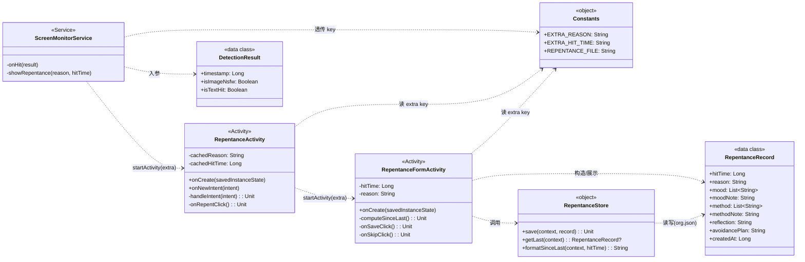
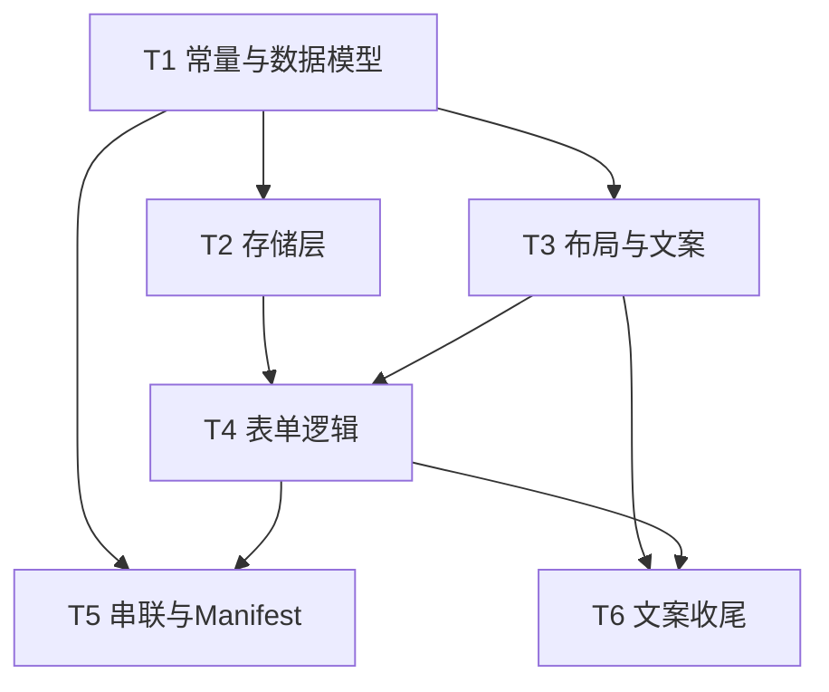

# 增量架构设计：悔改反思日志（Repentance Reflection Log）

> 作者：架构师 高见远（software-architect）
> 对应 PRD：`docs/incremental_prd_repentance.md`
> 范围：仅设计 + 任务分解，**不含实现代码**
> 平台：Android 离线（Kotlin + AndroidX，compileSdk/targetSdk/minSdk = 34/34/29，AGP 8.2.2，Gradle 8.3，JDK 17）

---

## 1. 实现方案 + 选型说明

### 1.1 为何用 JSON 文件（JSONL）而非 Room

| 维度 | JSONL 文件（选定） | Room（SQLite） |
|------|-------------------|----------------|
| 依赖 | **零额外 Gradle 依赖**（用 Android 内置 `org.json`，已在 framework 中） | 需引入 `androidx.room:room-*` + `kapt`/`ksp`，增加构建体积与复杂度 |
| 离线 | 完全符合"强制离线"（Manifest 无 INTERNET） | 同样离线，但杀鸡用牛刀 |
| 风格一致 | 沿用 `HitLogger` 的 `filesDir` 私有文件 + 逐行追加风格 | 与现有日志体系割裂 |
| 风险 | 极低：单文件顺序追加，读写量极小（个人使用） | 需定义 Entity/DAO/Migration，迁移成本高 |
| 查询需求 | 本迭代仅"取上一条"，无需复杂查询 | 复杂查询能力用不上 |

**结论**：采用 `filesDir/repentance_records.jsonl`，每行一个 `RepentanceRecord` 的 JSON 对象，追加写入。序列化/反序列化使用 `org.json.JSONObject`（`import org.json.*` 即可，**不增加任何依赖**），避免引入 `kotlinx.serialization` 等 Gradle 依赖。

### 1.2 表单与现有 `RepentanceActivity` 的跳转关系

- `RepentanceActivity` 与新增的 `RepentanceFormActivity` 属于**同一进程、同一任务栈**的普通 Activity 跳转，**无需任何新权限**（Manifest 已具备 `SYSTEM_ALERT_WINDOW` 允许后台 Service 起 Activity，且本项目不联网）。
- 跳转链：`ScreenMonitorService`（后台） → `RepentanceActivity`（前台/锁屏覆盖） → `RepentanceFormActivity`（反思表单）。
- ⚠️ **关键约束**：`RepentanceActivity` 在 Manifest 中为 `launchMode="singleTop"` 且由 Service 以 `FLAG_ACTIVITY_NEW_TASK or FLAG_ACTIVITY_CLEAR_TOP` 启动。因此 `EXTRA_REASON`、`EXTRA_HIT_TIME` **既可能经 `onCreate(intent)` 传入，也可能经 `onNewIntent(intent)` 传入**（singleTop 复用栈顶时走 `onNewIntent`）。
  → 设计上 `RepentanceActivity` 必须提供一个 `handleIntent(intent)` 辅助方法，**在 `onCreate` 与 `onNewIntent` 中均调用**，把两个 extra 暂存到成员变量，避免 singleTop 场景下 extra 丢失。
- 点击 `btn_repent` 时：`startActivity(表单 Intent 带 extra)` 并 `finish()` 自身（因 `noHistory=true`，栈中无残留）。表单 `finish()` 后回到被监控 App 当前界面（与"返回 BeHoly"语义一致：仅关闭覆盖层）。

### 1.3 "距上次"计算方式

- 打开表单 `onCreate` 时调用 `RepentanceStore.formatSinceLast(context, hitTime)`：
  1. 内部调 `getLast()` 读取 `repentance_records.jsonl` **最后一行**并解析为上一条 `RepentanceRecord`。
  2. 若无上一条记录 → 返回 **"首次"**。
  3. 若有 → 计算 `diff = hitTime（本次命中时间） − lastRecord.createdAt（上一条保存时间戳）`，按"天/小时/分钟"向下分段格式化（见 §6）。
- **语义**：PRD 默认"距上次 = 距上一条已保存的反思记录"，故以上一条记录的 `createdAt` 为基准（而非 `hitTime`），符合"成长记录回顾"的意图。

### 1.4 并发与线程建议

- 文件读写量极小，但 `getLast()` 需扫描整文件取最后一行，`save()` 为追加写。
- 建议在 `RepentanceFormActivity` 内用 `lifecycleScope.launch(Dispatchers.IO)` 执行 `getLast()`/`save()`，结果回主线程刷新 UI（与现有 `ScreenMonitorService` 用 `serviceScope` 一致）。
- 不强制使用 `BeHolyApp.applicationScope`（Activity 生命周期内用 `lifecycleScope` 更自然，且避免跨配置变更泄漏）。**结论**：Activity 内 `lifecycleScope + Dispatchers.IO` 即可，**无需**引入 `applicationScope` 或复杂并发。

---

## 2. 文件清单（新增 / 修改）

### 2.1 新增文件

| 相对路径 | 职责 |
|----------|------|
| `app/src/main/java/com/example/beholy/data/RepentanceRecord.kt` | 反思记录数据类 `RepentanceRecord`（纯数据，无逻辑） |
| `app/src/main/java/com/example/beholy/util/RepentanceStore.kt` | 反思记录存储：`save` / `getLast` / `formatSinceLast`，JSONL 读写（零依赖、离线） |
| `app/src/main/java/com/example/beholy/ui/RepentanceFormActivity.kt` | 反思表单界面：渲染字段、收集输入、计算"距上次"、保存/跳过 |
| `app/src/main/res/layout/activity_repentance_form.xml` | 表单布局：可滚动内容 + 底部固定按钮栏 |

### 2.2 修改文件

| 相对路径 | 修改点 |
|----------|--------|
| `app/src/main/java/com/example/beholy/data/Constants.kt` | 新增 `EXTRA_REASON`、`EXTRA_HIT_TIME`、`REPENTANCE_FILE`（文件名常量） |
| `app/src/main/java/com/example/beholy/ui/RepentanceActivity.kt` | 新增 `handleIntent()`（onCreate + onNewIntent 共用）；`btn_repent` 改为跳转表单并透传 extra；`btn_close` 保持 `finish()` |
| `app/src/main/java/com/example/beholy/service/ScreenMonitorService.kt` | `showRepentance(reason, hitTime)` 透传 `EXTRA_REASON` / `EXTRA_HIT_TIME`（hitTime 取 `result.timestamp`）；`onHit` 调用处补传 `result.timestamp` |
| `app/src/main/AndroidManifest.xml` | 注册 `RepentanceFormActivity`（含 `showWhenLocked`/`turnScreenOn`/`excludeFromRecents`，**无新权限**） |
| `app/src/main/res/values/strings.xml` | 新增心情/方法选项、提示语、保存/跳过、距上次文案等中文 string 资源 |
| `app/src/main/res/values/colors.xml`（可选） | 表单主题色（建议复用现有 `#1A1A2E`/`#16213E`/`#27AE60` 风格，非必须） |

> 注：现有 `RepentanceActivity` 布局文本硬编码在 XML 中；本迭代表单**统一改用 `strings.xml` 引用**（更利于文案维护，亦符合 PRD 要求），属有意的规范化改进。

---

## 3. 数据结构与接口

### 3.1 类图（Mermaid `classDiagram`）



### 3.2 `RepentanceRecord`（数据类，纯数据）

| 字段 | 类型 | 说明 / 默认 |
|------|------|------------|
| `hitTime` | `Long` | 本次命中时间（来自 `EXTRA_HIT_TIME`，即 `DetectionResult.timestamp`） |
| `reason` | `String` | 检测类型："成人画面" / "敏感文字" / "成人画面、敏感文字" |
| `mood` | `List<String>` | 感受心情（多选：空虚/愧疚/焦虑/愤怒/麻木/平静） |
| `moodNote` | `String` | 心情补充（可选，默认 `""`） |
| `method` | `List<String>` | 看的方法（可多选：浏览器/短视频/社交软件/论坛/相册/其他） |
| `methodNote` | `String` | 方法说明（可选，默认 `""`） |
| `reflection` | `String` | 反思（多行文本，可空，默认 `""`） |
| `avoidancePlan` | `String` | 以后避免方案（多行文本，可空，默认 `""`） |
| `createdAt` | `Long` | 保存时间戳 = `System.currentTimeMillis()`（保存时赋值） |

> ⚠️ 选型说明：`method` 采用 `List<String>`（支持单选/多选统一建模）。PRD 数据类示意写的是 `method:String`；若产品最终确认**仅单选**，可退化为 `String`。此处选 `List` 是为覆盖 PRD "单选或多项" 的待确认项，详见 §7。

### 3.3 `RepentanceStore`（object，零依赖）

```kotlin
object RepentanceStore {
    /** 追加一条反思记录（JSONL：末尾追加一行 JSON + "\n"） */
    fun save(context: Context, record: RepentanceRecord)

    /** 读取最后一条已保存记录；文件不存在/空则返回 null */
    fun getLast(context: Context): RepentanceRecord?

    /** 计算"距上次"文案：无记录→"首次"；否则按 天/时/分 格式化 */
    fun formatSinceLast(context: Context, hitTime: Long): String
}
```

- 使用 `File(context.filesDir, Constants.REPENTANCE_FILE)`（`REPENTANCE_FILE = "repentance_records.jsonl"`）。
- 序列化：`JSONObject` 逐字段 `put`（注意 `List` 用 `JSONArray`）。
- 反序列化：`getLast` 读全部行 → 取最后非空行 → `JSONObject` 解析 → 重建 `RepentanceRecord`（对缺失字段给默认值，保证向前兼容）。

### 3.4 与 `Constants` 的新增常量

```kotlin
const val EXTRA_REASON     = "extra_reason"      // 检测类型
const val EXTRA_HIT_TIME   = "extra_hit_time"    // 命中时间(Long)
const val REPENTANCE_FILE  = "repentance_records.jsonl"
```

---

## 4. 调用流程（时序图 Mermaid `sequenceDiagram`）

```mermaid
sequenceDiagram
    participant S as ScreenMonitorService
    participant R as RepentanceActivity
    participant F as RepentanceFormActivity
    participant ST as RepentanceStore
    participant FS as filesDir/repentance_records.jsonl

    Note over S: 检测循环命中
    S->>S: onHit(result)
    S->>S: reason = buildReason(result)
    S->>R: showRepentance(reason, result.timestamp)
    Note right of S: Intent 带 EXTRA_REASON + EXTRA_HIT_TIME，<br/>FLAG_ACTIVITY_NEW_TASK|CLEAR_TOP
    R->>R: onCreate / onNewIntent → handleIntent()
    R->>R: 暂存 cachedReason / cachedHitTime
    R-->>S: 界面显示，等待用户操作

    Note over R: 用户点击「我愿意悔改归向神」
    R->>F: startActivity(EXTRA_REASON, EXTRA_HIT_TIME); finish()
    F->>F: onCreate 读取 extra
    F->>ST: formatSinceLast(context, hitTime)
    ST->>FS: 读最后一行
    FS-->>ST: lastRecord? / null
    ST-->>F: "首次" 或 "3天2小时"
    F->>F: 顶部显示 检测类型+时间+距上次；渲染表单

    Note over F: 用户填写 心情/方法/反思/避免方案
    alt 点击「保存」
        F->>F: 收集输入 → 构造 RepentanceRecord(createdAt=now)
        F->>ST: save(record)
        ST->>FS: 追加一行 JSON\n
        F->>F: finish()
    else 点击「跳过」
        F->>F: 不写任何记录，直接 finish()
    end
```

---

## 5. 任务列表（有序 + 依赖）

> 任务粒度按"模块/层次"分组，每个任务均 ≥3 个相关文件或明确职责边界。优先级 P0 为本次必做。

| 任务 ID | 任务名 | 涉及文件 | 依赖 | 优先级 |
|---------|--------|----------|------|--------|
| **T1** | 常量与数据模型 | `data/Constants.kt`（新增 3 常量）、`data/RepentanceRecord.kt`（新增） | — | P0 |
| **T2** | 反思记录存储层 | `util/RepentanceStore.kt`（新增，含 `save`/`getLast`/`formatSinceLast` + JSONL 读写） | T1 | P0 |
| **T3** | 表单布局与资源文案 | `res/layout/activity_repentance_form.xml`（新增）、`res/values/strings.xml`（新增文案与选项数组）、`res/values/colors.xml`（可选风格） | T1 | P0/P1 |
| **T4** | 表单界面逻辑 | `ui/RepentanceFormActivity.kt`（新增：onCreate 读 extra、计算距上次、收集输入、保存/跳过） | T2, T3 | P0 |
| **T5** | 串联跳转与 Manifest | `ui/RepentanceActivity.kt`（handleIntent + btn_repent 跳转）、`service/ScreenMonitorService.kt`（showRepentance 透传）、`AndroidManifest.xml`（注册表单 Activity） | T1, T4 | P0 |
| **T6** | 资源文案收尾与风格统一 | `res/values/strings.xml`（温柔引导文案、保存/跳过、距上次提示）、`res/values/colors.xml`/`themes.xml`（如需统一表单风格） | T3, T4 | P1 |

**执行顺序建议**：`T1 → T2 → T3 → T4 → T5 → T6`。T2/T3 可并行（均只依赖 T1）；T6 与 T3/T4 有重叠，建议在 T3/T4 时一并落实文案，T6 仅做收尾校验。

### 5.1 任务依赖图（Mermaid `graph`）



---

## 6. 共享约定（跨文件，工程师必须遵守）

1. **Extra Key 命名**：统一使用 `Constants.EXTRA_REASON` / `Constants.EXTRA_HIT_TIME`，**禁止**在各处硬编码字符串字面量。
2. **JSONL 行格式**：每行一个完整 JSON 对象，`UTF-8`，行尾 `\n`；不允许跨行。示例：
   ```
   {"hitTime":1717000000000,"reason":"成人画面","mood":["空虚","焦虑"],"moodNote":"","method":["短视频"],"methodNote":"","reflection":"…","avoidancePlan":"…","createdAt":1717000123000}
   ```
3. **日期/时间格式化**：
   - 内部一律用 `Long` 毫秒时间戳存储（与 `DetectionResult.timestamp`、`HitLogger` 一致）。
   - 若需在 UI 展示"发生时间"，使用 `java.time`（`LocalDateTime` + `DateTimeFormatter`，minSdk 29 已原生支持，无需 desugaring）；如为兼容旧习惯，可沿用 `SimpleDateFormat`（与 `HitLogger` 同款）。
4. **"距上次"算法**（`formatSinceLast`）：
   ```
   last = getLast()
   if last == null → return "首次"
   diff = hitTime - last.createdAt
   days  = diff / 86_400_000
   hours = (diff % 86_400_000) / 3_600_000
   mins  = (diff % 3_600_000) / 60_000
   拼接规则：
     days  > 0 → "${days}天${hours}小时"
     hours > 0 → "${hours}小时${mins}分钟"
     else      → "${mins}分钟"
   ```
   （采用向下截断到"天/时/分"聚合，不向上取整，避免虚高；如产品要求"至少 1 天"式展示再调整。）
5. **心情 / 方法预设选项来源**：选项字符串数组放 `strings.xml`（如 `string-array name="mood_options"` / `method_options`），`RepentanceFormActivity` 通过 `resources.getStringArray(...)` 加载；新增/修改选项只动资源文件，不改代码。
6. **锁屏可见性**：`RepentanceFormActivity` 在 Manifest 声明 `android:showWhenLocked="true"`、`android:turnScreenOn="true"`、`android:excludeFromRecents="true"`，确保从锁屏悔改界面进入表单后仍可见（与 `RepentanceActivity` 一致）。
7. **写入线程**：`save` / `getLast` 在 `Dispatchers.IO` 执行（经 `lifecycleScope`）；UI 刷新回主线程。
8. **离线铁律**：全程不新增任何网络权限/调用；所有数据仅存于 `filesDir` 私有目录。

---

## 7. 待明确事项（架构层面需关注）

1. **`method` 单选 vs 多选（PRD 待确认）**
   - 当前设计采用 `List<String>` 以支持多选；若产品确认仅单选，可退化为 `String` + 单选 Chip。
   - 影响：数据类字段、`RepentanceStore` 序列化、`RepentanceFormActivity` 的 Chip 选择逻辑。
2. **"跳过"是否真不写任何记录**
   - 按 PRD P0-5：跳过 = 不写记录，仅 `finish()`。已据此设计。
   - 备选：是否要记一条"用户跳过反思"的轻量标记（不写反思内容）？当前**不记**，如需审计再议。
3. **表单是否拦截返回键**
   - `RepentanceActivity` 拦截返回（防跳过）。表单建议**不拦截**：返回键 = 视为"跳过"（不写记录 + `finish()`），避免把用户困在反思表单造成反感。
   - 需产品确认：强制选择"保存/跳过" vs 允许返回即跳过。
4. **"距上次"基准字段**
   - 采用上一条记录的 `createdAt`。若产品希望用"上一条的 `hitTime`"（即上次被提醒时间）作为基准，仅需改 `formatSinceLast` 中引用字段，影响极小。
5. **表单 `finish()` 后去向**
   - 当前设计：`finish()` 后回到被监控 App 当前界面（与"返回 BeHoly"关闭覆盖层一致）。
   - 若产品希望反思后强制回 BeHoly 主页（弹主界面），需额外 `startActivity(MainActivity)` 逻辑——本设计默认不强制。
6. **`moodNote` / `methodNote` 是否纳入**
   - PRD 提"可选补充/可选说明"，已预留 `moodNote`/`methodNote` 字段（默认空）。如确认不需要可移除，简化数据类。
7. **`RepentanceActivity` singleTop 复用**
   - 已在 §1.2 强调：必须 `handleIntent()` 同时覆盖 `onCreate` 与 `onNewIntent`，否则 `EXTRA_*` 在栈顶复用场景下丢失——**这是本增量最易踩的坑**，请在 T5 重点验证。

---

## 8. 风险与回归提示（给 QA / 工程师）

- 不联网、不新增权限，回归现有截屏检测流程无影响。
- 需验证：锁屏场景下 Service → RepentanceActivity → RepentanceFormActivity 三层跳转均正常可见。
- 需验证：`RepentanceActivity` 在已有实例（singleTop）时被再次触发，`EXTRA_REASON`/`EXTRA_HIT_TIME` 仍正确传递。
- 需验证：`repentance_records.jsonl` 追加不破坏既有行（逐行独立 JSON）。
- P2（本迭代不做）：历史查看页、导出统计、金句联动——预留数据模型兼容性即可，不实现。
