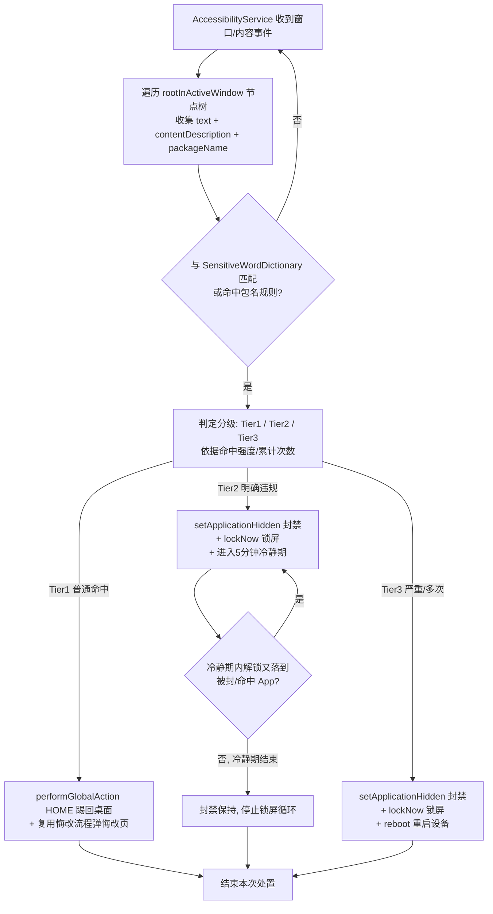

# 增量 PRD：BeHoly 无障碍重构（AccessibilityService 检测 + 分级处置）

> **作者**：产品经理「许清楚」（software-product-manager）
> **对应增量**：BeHoly 无障碍重构（检测机制由 MediaProjection 截屏链切换为 AccessibilityService；新增分级处置与权限引导；移除图像模型与对应依赖）
> **范围**：仅 PRD（产品定义与变更说明），不含实现代码
> **平台与约束**：Android 离线个人 App（Kotlin + AndroidX）；包名 `com.example.beholy`；minSdk 29、**compileSdk/targetSdk 升至 34→36（Android 16）**；**强制离线铁律：Manifest 不声明 INTERNET，无任何网络调用**；目标设备 魅族 21 / 骁龙 8 Gen 2 / Android 16（API 36）

---

## 0. 变更对照（相对现有产品，仅列"差异"）

本文档只描述**变更部分**。悔改反思日志全流程（`RepentanceActivity` → `RepentanceFormActivity` → `RepentanceStore`）、`HitLogger`、`SensitiveWordDictionary`、`Constants` 等**保留项**不重写，仅说明其在本增量中的衔接点。

| 维度 | 现有产品（基线） | 本增量变更后 |
|---|---|---|
| 检测机制 | `MediaProjection` 截屏 → ML Kit OCR 文本 → open_nsfw TFLite 图像评分 | **AccessibilityService** 遍历 `AccessibilityNodeInfo` 视图树取文本+`contentDescription`，与敏感词库匹配；读取前台 `packageName` |
| 图像/ML 依赖 | ML Kit text-recognition、TensorFlow Lite、open_nsfw 模型 | **全部移除**（无障碍拿不到屏幕像素，图像模型物理不可行） |
| 常驻性 | MediaProjection 锁屏被系统停止、需反复授权 | 无障碍服务常驻、跨锁屏解锁无感、事件驱动零轮询 |
| 处置强度 | 仅弹悔改页（`showRepentance`） | 新增 **分级处置**：Tier1 踢回桌面+悔改；Tier2 封禁+锁屏+冷静期；Tier3 封禁+锁屏+重启 |
| 权限模型 | MediaProjection 授权引导 | **AccessibilityService（手动开启）** + **Device Owner（`adb dpm set-device-owner`）** |
| compile/target | 34 | **36（Android 16）** |
| 卸载约束 | 普通卸载 | 设为 Device Owner 后，正常卸载前需先移除设备所有者（通常需出厂重置） |

---

## 1. 产品目标

1. **用无障碍服务实现常驻、跨锁屏、零轮询检测**：以 `AccessibilityService` 替代易被系统中断、需反复授权的 MediaProjection 截屏链，让屏幕内容监测在锁屏/解锁全程无感运行、功耗极低。
2. **以分级处置匹配违规严重程度**：普通命中温和止损（踢回桌面+悔改），明确违规强制中断（封禁+锁屏+冷静期），严重/多次命中物理切断（封禁+锁屏+重启），干预强度随风险递增。
3. **以一次性、可自检的权限引导完成离线部署**：清晰指引"开启无障碍"与"配置 Device Owner"两步，并实时显示状态，让用户在无网络环境下也能正确、安心地完成部署。

---

## 2. 用户故事

1. **作为**使用者，**我**希望无障碍服务在锁屏前后都持续监听屏幕内容，**以便**跨解锁无感检测、无需每次重新授权。
2. **作为**被提醒的使用者，**我**在普通命中时被踢回桌面并弹出悔改页，**以便**及时止损，又不过度严厉。
3. **作为**使用者（或守护者），**我**在遇到明确违规内容时该 App 被封禁并立即锁屏，**以便**强制中断接触、进入冷静期。
4. **作为**使用者，**我**在严重/多次命中时被重启设备，**以便**物理上彻底切断当前会话、避免持续越界。
5. **作为**部署者，**我**希望有明确引导告诉我如何开启无障碍权限与配置 Device Owner，并能看到当前状态与"已设设备所有者"提示，**以便**正确、安心地完成离线部署。

---

## 3. 需求池（P0 必须 / P1 建议 / P2 可选）

> 优先级：**P0**=必须（本迭代交付）；**P1**=建议（尽量同批）；**P2**=可选（后续迭代）。每条含 编号 / 描述 / 优先级 / 验收标准。

### 3.1 P0（必须）

| 编号 | 描述 | 优先级 | 验收标准 |
|---|---|---|---|
| **P0-1** | **无障碍检测服务**：新增 `AccessibilityService` 子类（建议 `ScreenAccessibilityService`）。监听窗口切换/内容变更事件，遍历 `rootInActiveWindow` 的 `AccessibilityNodeInfo` 视图树，递归收集所有节点的 `text` 与 `contentDescription`；同时读取当前前台 App 的 `packageName`（取自事件或节点）。文本与 `SensitiveWordDictionary`（复用 `assets/sensitive_words.txt`）匹配得出命中。 | P0 | 服务在系统设置开启后能接收事件；遍历可拿到可见界面全部文本与包名；命中结果可驱动后续处置；**事件驱动、不轮询**；不引入任何网络调用。 |
| **P0-2** | **Tier 1 处置（普通命中）**：调用 `AccessibilityService.performGlobalAction(GLOBAL_ACTION_HOME)` 踢回桌面，并复用现有悔改流程（等同 `ScreenMonitorService.showRepentance`）弹出悔改页。 | P0 | 普通命中 → 回到桌面 + 悔改页弹出；悔改表单全流程（P0-1~P0-6 of 悔改增量）可正常进入并保存；行为与基线悔改体验一致。 |
| **P0-3** | **Tier 2 处置（明确违规）**：`DevicePolicyManager.setApplicationHidden(pkg, true)` 封禁该 App（进程被杀、无法再打开）+ `DevicePolicyManager.lockNow()` 立即锁屏；进入 **5 分钟冷静期**，期间若解锁后前台又落到被封/命中 App，则循环再次 `lockNow()`。 | P0 | 明确违规 → 目标 App 被隐藏且不可打开、立即锁屏；冷静期内再次落到该 App 反复锁屏；5 分钟后锁屏循环停止（封禁状态保持，见待确认 Q5）。 |
| **P0-4** | **Tier 3 处置（严重/多次命中）**：封禁（`setApplicationHidden`）+ 锁屏（`lockNow()`）+ `DevicePolicyManager.reboot()` 重启设备（作为无法 root 关机的替代方案）。 | P0 | 严重/多次命中 → 目标 App 被封 + 立即锁屏 + 设备重启；重启后 Device Owner 与封禁状态保持（具体恢复行为见待确认 Q7）。 |
| **P0-5** | **权限引导 + 状态自检**（承载于 `MainActivity`）：①无障碍开启引导——检测本服务是否已在系统"已下载的服务"中启用，未启用则给出跳转系统设置入口与步骤说明；②Device Owner 配置引导——展示 `adb shell dpm set-device-owner com.example.beholy/.BeHolyAdminReceiver` 命令与执行说明，并自检当前是否已是 Device Owner；③两项的实时状态指示（已配置/未配置）。需新增 `BeHolyAdminReceiver`（`DeviceAdminReceiver` 子类）并在 Manifest 注册。 | P0 | 主界面可见两项引导与状态；点无障碍引导可跳系统设置；Device Owner 自检正确反映 `dpm` 状态；`BeHolyAdminReceiver` 已注册且 `DevicePolicyManager` 可获取。 |
| **P0-6** | **移除 MediaProjection 与图像模型及依赖**：删除 `capture/ScreenCapturer.kt`、`capture/CaptureConfig.kt`、`service/DetectionLoop.kt` 中 MediaProjection 相关部分、`detection/image/ImageNsfwDetector.kt`、`detection/image/TfLiteModelLoader.kt`、`detection/text/TextNsfwDetector.kt` 中基于 OCR 位图的部分；移除 ML Kit text-recognition 与 TensorFlow Lite 的 Gradle 依赖、`BitmapUtils` 图像预处理部分；Manifest 移除 MediaProjection 相关权限声明与截屏引导流程；`compileSdk/targetSdk` 升至 **36**。 | P0 | 工程中不再引用 MediaProjection / ML Kit / TFLite；`build.gradle` 无相关依赖；Manifest 无截图相关权限；全量编译通过且 `minSdk 29` 不变；离线铁律（无 INTERNET）保持。 |
| **P0-7** | **检测数据模型衔接**：调整检测产出以适配新机制——移除 `DetectionResult` 中图像相关字段（`isImageNsfw`/`imageScore`），新增 `packageName`、`tier`（Tier1/2/3）、`source`（文字/包名）等；确保 `showRepentance(reason, hitTime)` 仍能向悔改流程透传 `reason` 与 `hitTime`，复用既有 extra 常量（`EXTRA_REASON`/`EXTRA_HIT_TIME`）。 | P0 | 悔改页与反思表单收到的 `reason`/`hitTime` 与基线一致；新增 `tier`/`packageName` 可被处置逻辑消费；不破坏 `RepentanceStore` JSONL 结构。 |

### 3.2 P1（建议）

| 编号 | 描述 | 优先级 | 验收标准 |
|---|---|---|---|
| **P1-1** | **Tier 3 判定阈值配置**：提供"严重/多次命中"升级为 Tier 3 的判定配置（如累计命中次数阈值、或特定高危词库分级），默认策略需明确（见待确认 Q1）。 | P1 | 可在本地配置阈值；达到阈值才触发 reboot；默认值可解释。 |
| **P1-2** | **冷静期时长配置**：Tier 2 的 5 分钟冷静期可配置（默认 5 分钟）。 | P1 | 时长可改；锁屏循环按配置时长执行。 |
| **P1-3** | **设备所有者状态提示**：在 `MainActivity` 或设置区明确提示"本机已设为设备所有者，正常卸载 BeHoly 前需先移除设备所有者（通常需出厂重置）"。 | P1 | 文案可见、语气中性、提示卸载约束。 |
| **P1-4** | **封禁列表查看**：提供被 `setApplicationHidden` 封禁的 App 列表展示（仅展示包名/应用名，不含解封操作）。 | P1 | 可看到当前被封 App 清单。 |

### 3.3 P2（可选）

| 编号 | 描述 | 优先级 | 验收标准 |
|---|---|---|---|
| **P2-1** | **封禁手动解封入口**：冷静期结束后可对封禁 App 执行 `setApplicationHidden(pkg, false)` 解封。 | P2 | 提供解封操作并生效；与冷静期逻辑不冲突。 |
| **P2-2** | **reboot 前倒计时提示**：Tier 3 重启前给用户 3 秒倒计时提示（语气中性，如"设备即将重启以中断会话"）。 | P2 | 触发重启前有可感知的短暂提示；仍可执行 reboot。 |
| **P2-3** | **检测灵敏度/词库白名单配置**：词库分级或按包名设置忽略名单，降低误封。 | P2 | 白名单/灵敏度可本地配置并生效。 |

---

## 4. UI 设计要点（文字描述 + 布局示意）

### 4.1 总体原则

- **悔改流程界面（RepentanceActivity / RepentanceFormActivity）保持不变**，本增量不改动其文案与布局。
- 变更集中在 **`MainActivity`**：新增"无障碍权限"与"设备所有者(Device Owner)配置"两个引导区块及状态指示；并在适当位置给出设备所有者卸载约束提示。
- 所有新增文案中文、语气中性清晰，遵循离线、个人使用的基调。

### 4.2 MainActivity 新增引导区（示意）

```
┌─────────────────────────────────────────────┐
│  BeHoly · 屏幕内容安全监测                     │
├─────────────────────────────────────────────┤
│ ［步骤 1］无障碍权限                           │
│   状态：● 已开启 / ○ 未开启                    │
│   说明：用于实时监测屏幕文本，离线常驻。        │
│   [ 前往系统设置开启 ]（未开启时显示）          │
├─────────────────────────────────────────────┤
│ ［步骤 2］设备所有者 (Device Owner) 配置        │
│   状态：● 已配置 / ○ 未配置                    │
│   说明：用于封禁/锁屏/重启等管控能力。          │
│   命令：adb shell dpm set-device-owner \       │
│         com.example.beholy/.BeHolyAdminReceiver │
│   [ 复制命令 ]  [ 我已执行，重新检测 ]          │
├─────────────────────────────────────────────┤
│ ⚠ 提示：本机已设为设备所有者，正常卸载 BeHoly    │
│   前需先移除设备所有者（通常需出厂重置）。        │
├─────────────────────────────────────────────┤
│  （下方保留既有：监测状态、悔改日志入口等）       │
└─────────────────────────────────────────────┘
```

- **状态自检**：`MainActivity` onResume 时检测①无障碍服务是否启用（`Settings.Secure` 中是否包含本服务）；②是否 `DevicePolicyManager.isDeviceOwnerApp()`。两项均"已开启/已配置"才可视为就绪。
- **未开启态**：无障碍引导按钮跳转 `ACTION_ACCESSIBILITY_SETTINGS`；Device Owner 引导展示 adb 命令与复制按钮，并提供"重新检测"手动刷新状态。
- **设备所有者提示**（P1-3）：以中性语气明确卸载约束，避免用户误操作后无法卸载。

---

## 5. 检测与分级处置流程（Mermaid 流程图）



---

## 6. 待确认问题（需用户/主理人拍板，不在此自答）

| 编号 | 问题 | 备注 |
|---|---|---|
| **Q1** | **Tier 3（严重/多次命中）判定阈值如何定**？按累计命中次数（如 N 次）、特定高危词库分级，还是由 Tier2 升级而来？ | 影响 P1-1 默认值与 reboot 触发频率 |
| **Q2** | **Tier 1 / Tier 2 的划分标准**？普通命中 vs 明确违规如何区分（词库分级？包名黑名单？） | 决定哪些命中只踢回、哪些直接封禁 |
| **Q3** | **冷静期时长是否可配置**？默认 5 分钟是否合适？ | 影响 P1-2 |
| **Q4** | **reboot 前是否给用户 3 秒倒计时提示**？提示文案与语气？ | 影响 P2-2；需权衡"中断强度"与"用户体验" |
| **Q5** | **Tier 2 封禁是否自动解封**？冷静期结束后 App 保持隐藏（需手动解封）还是自动恢复可见？ | 影响 P2-1 是否必须；默认建议保持封禁 |
| **Q6** | **是否提供封禁手动解封入口**？以及解封是否需要额外确认/密码？ | 影响 P2-1 与误封恢复 |
| **Q7** | **重启后状态恢复**：reboot 后 AccessibilityService 是否需用户重新开启（魅族 21 系统行为）？Device Owner 与封禁状态是否持久？ | 影响 P0-4 实际可用性，需真机验证 |
| **Q8** | **Device Owner 对个人单机使用的副作用**：是否影响系统更新、其他应用、或导致无法普通卸载？是否有更轻量的设备管理员（非 DO）即可满足 lockNow/reboot/setApplicationHidden？ | 影响权限模型与卸载约束提示 |
| **Q9** | **遍历性能与误触**：检测事件频率（仅窗口切换？还是内容变更也触发？）如何平衡功耗与漏检？长列表/动态内容是否会误命中？ | 影响 P0-1 实现策略 |

---

## 7. 范围与交付说明

- **本迭代交付（P0）**：P0-1 无障碍检测服务、P0-2 Tier1 处置、P0-3 Tier2 处置、P0-4 Tier3 处置、P0-5 权限引导+状态自检+`BeHolyAdminReceiver`、P0-6 移除 MediaProjection/图像模型/依赖并升 API 36、P0-7 检测数据模型衔接。
- **建议同批（P1）**：Tier3 阈值配置、冷静期配置、设备所有者状态提示、封禁列表查看。
- **后续迭代（P2）**：手动解封、reboot 倒计时、灵敏度/白名单配置。
- **不涉及**：悔改反思日志界面与存储（沿用既有增量）、任何网络能力（始终保持离线铁律）、云端同步。
- **下游协作**：架构师据此做增量设计与任务拆解（重点关注无障碍服务与 DevicePolicyManager 的权限边界、冷静期锁屏循环实现、与既有悔改流程的衔接）；工程师实现时复用 `findViewById`/既有资源风格、不新增 INTERNET 权限；QA 依 P0 验收标准真机（魅族 21 / Android 16）回归，重点验证锁屏前后检测连续性与分级处置实际效果。
